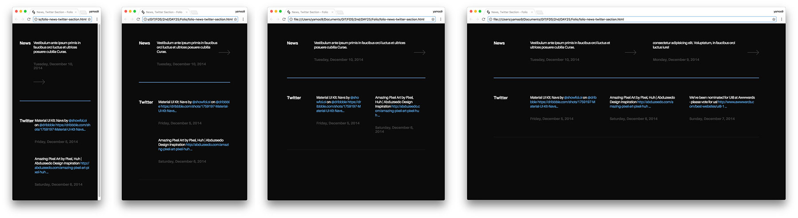

# DAY 19

## 반응형 그리드 시스템(Responsive Grid System)

#### 워크프로세스

- __Mobile First__ 
Mobile → Tablet → Desktop
- __Desktop First__ 
Desktop → Tablet → Mobile

#### 중단점 모듈 프리픽스

- `s` | `xs`(`mobile`)
- `s` | `sm`(`mobile`)
- `m` | `md`(`tablet`)
- `l` | `lg`(`desktop`)
- `l` | `xl`(`wide`)

#### 컬럼 모듈

- `{s}-1of2`(`{xs}--1-2`)
- `{m}-1of3`(`{sm}--1-3`)
- `{l}-2of3`(`{md}--2-3`)
- `{s}-1of4`(`{lg}--1-4`)
- `{m}-2of4`(`{xl}--2-4`)
- `{l}-3of4`(`{xs}--3-4`)

-

### 반응형 그리드 CSS 참고 파일

[RWD-GRID](RWD-GRID/README.md)

-

### 플렉스박스 모던 기술을 사용한 그리드 시스템(Flexbox Grid System)

지금까지의 CSS 레이아웃은 `float` 또는 `position` 등을 사용하여 제작했습니다. 그러나 이러한 기술들은 요구되는 레이아웃을 구현하기에는 각각 취약점을 가지고 있습니다.

`float`의 경우는 해제(clear)를 설정하지 않을 경우 다음에 위치한 요소에 영향을 미치는 문제가 있으며, 이 문제를 해결하기 위한 방법을 사용할 경우 `::before`, `::after`를 사용하기에 다른 용도로는 사용될 수 없는 문제 또한 가집니다.

`position`의 경우는 그리드 시스템보다는 각 객체 간 정밀한 위치 조정에 더 많이 사용되고 있습니다. 그리드 시스템에는 적합하지 않기 때문이죠.

Flexbox는 이러한 문제를 모두 해결하는 모던 레이아웃 CSS 모듈입니다. Flexbox를 사용한 그리드 시스템은 아래 나열된 요구사항을 모두 충족합니다.

#### 그리드 시스템 요구사항

- 기본적으로 행(`row`)의 각 그리드 셀(`cell`)은 같은 폭과 높이를 가짐.
- 더 세심한 조정을 위한 각각의 그리드 셀(`cell`) 크기 클래스 속성을 추가. 클래스 속성이 없으면 남은 공간을 자동 배분.
- 반응형 그리드(Responsive Grid)를 위한 미디어쿼리 프리픽스 클래스 속성을 그리드 셀에 적용 가능.
- 각 행의 콘텐츠를 수평 방향(`left` | `center` | `right`)으로, 각 그리드 셀은 수직 방향(`top` | `middle` | `bottom`)으로 정렬 가능.
- 모든 그리드 셀에 동일한 설정을 원한다면 행에 이를 제어하기 위한 클래스 속성을 추가하는 것으로 불 필요한 반복을 제거.
- 중첩된 그리드 레이아웃이 가능.

#### 플렉스박스 그리드시스템

- 유연한 그리드(Fluid grid)
- 반응형 그리드(Responsive grid)
- 스마트 컬럼(Smart columns)
- 거터 제거(Gutterless)
- 중첩 그리드 레이아웃(Subgrids)
- 순서 변경(Reverse order)
- 정렬(Alignment)
- 감춤(Hide)

-

### Folio

Beautiful responsive portfolio UI Kit

#### SCHOOL 수강생 실습 결과물

- [github.com/nayea/Folio](https://github.com/nayea/Folio)
- [joeun2.github.io/FDS/main/homework/folio](https://joeun2.github.io/FDS/main/homework/folio/)

#### 수강생이 어려워한 파트 강사 실습 결과물

[Folio.zip](./Folio/Folio.zip)
