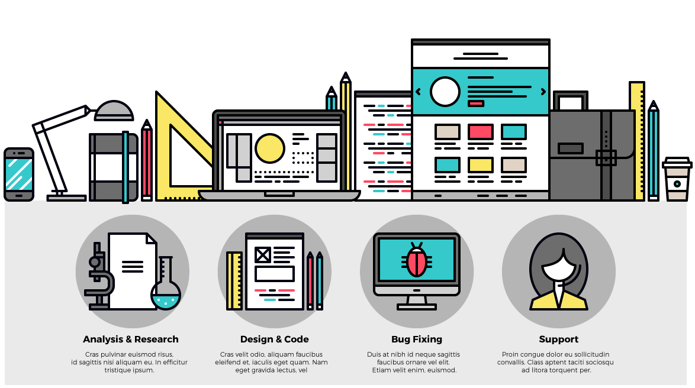

###### FastCampus

# [Front-End Design CAMP](http://www.fastcampus.co.kr/dev_camp_dfep/)

본 과정에서는 **GOOD DESIGN** 방법론을 기반으로 하여 모던 웹 사이트를 제작해봅니다. 디자인 이론에 충실한 실전 방법론을 통해 설득력있고 논리적인 웹 사이트를 디자인한 후, 프론트엔드 웹 언어(`HTML`/`CSS`)로 구성된 페이지를 만들어가는 과정을 공부하게 됩니다. 디자인부터 제작까지 단언컨데 매우 흥미로운 여정이 될 것입니다!

#### 디자이너의, 디자이너를 위한, 디자이너에 의한

디자인 발상, 기획, 그리고 기획서에 표현된 디자인을 직접 코드로 구현하기 위해 어떤 지식이 필요한지 전적으로 디자이너의 입장에서 전달합니다. 디자이너 출신의 프론트엔드 개발자 야무님의 알토란 같은 노하우를 모조리 가져가세요.

#### 포트폴리오, 결과물이 나올 수밖에 없는 실습위주 강의

하나의 웹 페이지가 제작되기까지 전 과정을 커리큘럼에 그대로 녹여냈습니다. 웹디자인 방법론(타이포그래피, 그리드시스템, 황금분할)에서 시작하여 PSD디자인 시안을 HTML/CSS 웹사이트로 제작하는 실습까지 10주간 진행합니다. 11,12주차는 포트폴리오 제작에 집중하여 전 수강생이 퀄리티 높은 결과물을 가져갈 수 있도록 밀착 지도해드립니다.

[**GOOD DESIGN** 방법론 `타이포그래피`×`모듈러 스케일`×`버티컬 리듬`×`그리드 시스템`×`황금 비율`](REFERENCE.md)

-

### Pre Survey

[과정 시작 전, 사전 조사](http://goo.gl/forms/5UMcSc9wIPcnDGBJ3)

-

### Agenda

### 1. 웹 디자인 워크플로우 살펴보기

- 웹디자인에 최적화된 환경설정
- 원활한 업무 협업을 위한 역할 프로세스 이해
- 웹 표준/접근성을 준수한 마크업/스타일링
- 비주얼 디자인을 넘어 상태 디자인 구현

-

### 2. 웹 타이포그래피, 그래픽 데이터, HTML/CSS 구조 & 스타일링

- 웹 타이포그래피 기초/응용
- 타이포그래피 웹 브라우저 기본 설정
- HTML 구조화, 의미를 부여하는 바른 마크업
- CSS 스타일링. 컴팩트한 스타일 적용

-

### 3. 웹 타이포그래피, 그래픽 데이터, HTML/CSS 구조 & 스타일링

- Headings, Paragraph, Lists, Tables, Forms 등 구성요소 별 UI Kit 제작
- 고정 단위(px)와 상대 단위(em, rem, %, vw, vh)의 상황 별 적절한 활용
- Vertical Rhythm 구현 (공식 활용)

-

### 4. CSS 박스모델과 레이아웃(FLOAT, POSITION, FLEX)

#### 박스모델 이해 및 레이아웃 별 구현 실습

- Box-Model
- Float
- Clearfix
- Position
- Flex

-

### 5. 웹 그리드 시스템

#### 그리드 시스템 구조 이해

- Container
- Row
- Column
- Gutter
- Module
- 그리드 시스템 그리는 방법 (with Photoshop)

-

### 6. CSS 그리드 시스템 모듈

#### 재사용 가능한 CSS 그리드 시스템 모듈 구현

- `.container` 모듈
- `.row` 모듈
- `.col` 모듈
- `.push`, `.pull` 모듈
- `.prefix`, `.suffix` 모듈
- `.clearfix` 모듈

-

### 7. HTML5/CSS3 애니메이션 배너 디자인

#### CSS3 애니메이션 모듈

- `transition`
- `animation`
- `@keframes` 활용

-

### 8. 반응형 웹 (RWD)

- 반응형 웹 디자인 레이아웃 대응 그리드 시스템
- 고해상도 디스플레이/반응형 웹 이미지 대응 방법
- 모바일 퍼스트
- 단계적 기능 향상
- Adapt Web 구현

-

### 9. 와이어프레임

- 콘텐츠 선정
- 중단점 설계
- 타이포그래피 / 그리드 시스템 구축
- 와이어프레임 제작 (PSD)

-

### 10. 포트폴리오

- 비주얼 목업 제작
- HTML/CSS 마크업, 스타일링
- View 파트에 따른 반응형 대응 처리
- 크로스 브라우징 테스트
- Git Page에 빌드 / 배포

---

[Front-End Design CAMP, FastCampus](http://www.fastcampus.co.kr/dev_camp_dfep/) / [yamoo9.net](http://yamoo9.net)
