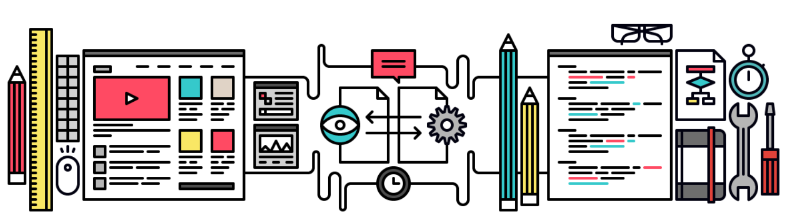

[← Main](README.md)

## Reference

[프론트엔드 디자인 CAMP](http://www.fastcampus.co.kr/dev_camp_dfep) 강의와 관련하여 복습 시, 참고할 수 있는 레퍼런스를 제공합니다.

-

##### Design Theory
- [디자인 프로세스](https://github.com/yamoo9/PSD2HTML-CSS/wiki/%EB%94%94%EC%9E%90%EC%9D%B8-%ED%94%84%EB%A1%9C%EC%84%B8%EC%8A%A4)
- [웹 타이포그래피](https://github.com/yamoo9/PSD2HTML-CSS/wiki/%EC%9B%B9-%ED%83%80%EC%9D%B4%ED%8F%AC%EA%B7%B8%EB%9E%98%ED%94%BC)
- [웹 그리드 시스템](https://github.com/yamoo9/PSD2HTML-CSS/wiki/%EC%9B%B9-%EA%B7%B8%EB%A6%AC%EB%93%9C-%EC%8B%9C%EC%8A%A4%ED%85%9C)
- [황금 비율](https://github.com/yamoo9/PSD2HTML-CSS/wiki/%EC%9E%90%EC%97%B0-%EC%95%88%EC%97%90%EC%84%9C-%EC%B0%BE%EC%9D%80-%ED%99%A9%EA%B8%88-%EB%94%94%EC%9E%90%EC%9D%B8)
- [모듈러 스케일](http://type-scale.com/)
- [버티컬 리듬](https://24ways.org/2006/compose-to-a-vertical-rhythm)
    - [Incremental Leading](http://www.markboulton.co.uk/journal/incremental-leading)
    - [Basehold](http://www.basehold.it/)
- [디스플레이상에서 폰트의 크기,굵기,명도](http://yeun.github.io/2016/03/09/font-weight-and-color.html)
- [UX 디자이너는 코딩을 배워야 할까](http://story.pxd.co.kr/1142)

-

##### Front-End Techniques

- 영문
    - [w3schools.com](http://www.w3schools.com/)
    - [Learn The Web by Algonquin College Graphic Design](https://learn-the-web.algonquindesign.ca/topics/)
    - [JavaScript Tutorial for Absolute Beginners](https://www.youtube.com/watch?v=XL9Ri8pO68w)
    - [30 Days to Learn HTML&CSS](https://www.youtube.com/watch?v=yTHTo28hwTQ&list=PLgGbWId6zgaWZkPFI4Sc9QXDmmOWa1v5F)
    - [30 Days to Learn jQuery](https://www.youtube.com/watch?v=_ZYy4kof5Oo&list=PLuwqxbvf3olp-FNFjkdWyNvrh_DCkH_TA)
    - [ES6 Learning](https://github.com/ericdouglas/ES6-Learning)

- 번역
    - [MDN: Mozilla 개발자 네트워크](https://developer.mozilla.org/ko/)
    - [CSS 레이아웃을 배웁시다](http://ko.learnlayout.com/)
    - [위키: 해외 아티클 번역 모음](https://github.com/nolboo/nolboo.github.io/wiki)

- 한글
    - [생활코딩 HTML](https://opentutorials.org/course/2039)
    - [생활코딩 CSS](https://opentutorials.org/course/45/2)
    - [생활코딩 Javascript](https://opentutorials.org/course/1375)

-

##### Online Tools

- [Toolmarklets](http://www.toolmarklets.com/)
- [placeit](https://placeit.net/)
- [Typografier](http://typografier.web-dev.tools)
- [Modulifier](http://modulifier.web-dev.tools)
- [Gridifier](http://gridifier.web-dev.tools)

-

##### Photoshop Plugins

###### Custom Manager CC

- [PVII Extension Manager CC](http://projectseven.com/products/ex-man/info.htm)

###### Guide

- [Griddify](http://gelobi.org/griddify/)
- [GuideGuide](http://guideguide.me/)
- [Templay](http://templay.maketheweb.pl/)

###### Dimension

- [Specctr](https://www.specctr.com/)
- [Specking](http://www.wuwacorp.com/specking/)
- [Size Marks PS](https://github.com/romashamin/Size-Marks-PS)

###### Uber Plugins

- [uberplugins](http://uberplugins.cc/)

###### Color Management
- [ColorKit](http://colorkit.maketheweb.pl/)

###### Image

- [SplasHolder](http://splasholder.pixoil.com/)

###### Kam88 Scripts

- [Expanding Smart Objects](http://blog.kam88.com/en/expanding-smart-objects-script.html)
- [Transform Each 2.1](http://blog.kam88.com/en/transform-each-21-update.html)
- [RotateMe 3.0](http://blog.kam88.com/en/rotateme-30.html)
- [Isometrify](http://blog.kam88.com/en/isometrify.html)

-

##### Etc.

- [The Ultimate Guide To The Best Specs Plugins For Photoshop](http://blog.yummygum.com/post/99044078154/the-ultimate-guide-to-the-best-specs-plugins-for)
- [25 Best Web Design & Development Tools 2016](http://bashooka.com/coding/25-best-web-design-development-tools-2016/)
- [CSS & PSD Grid Layout Generators](http://bashooka.com/freebie/css-psd-grid-layout-generators/)
- [CSS Flexbox : 15 Resources To Get You Started](http://bashooka.com/coding/css-flexbox-15-resources-to-get-you-started/)
- [32 Amazing Text Effect Photoshop Actions](http://bashooka.com/photoshop/32-amazing-text-effect-photoshop-actions/)
- [18 Detailed Photoshop UI Design Tutorials](http://bashooka.com/photoshop/18-detailed-photoshop-ui-design-tutorials/)
- [Free PSD Perspective App Mockups](http://designmodo.com/perspective-app-mockups/)

-

##### Mobile

- [Viewport & Media Queries, The Complete Idiot's Guide](https://docs.google.com/presentation/d/1rmxwWa9P6_xHqonmh5ONXRS-jPc5XKbnv99Rjkhe04s/present?slide=id.i0)
- [a pixel is not a pixel is not a pixel](http://www.quirksmode.org/blog/archives/2010/04/a_pixel_is_not.html)
